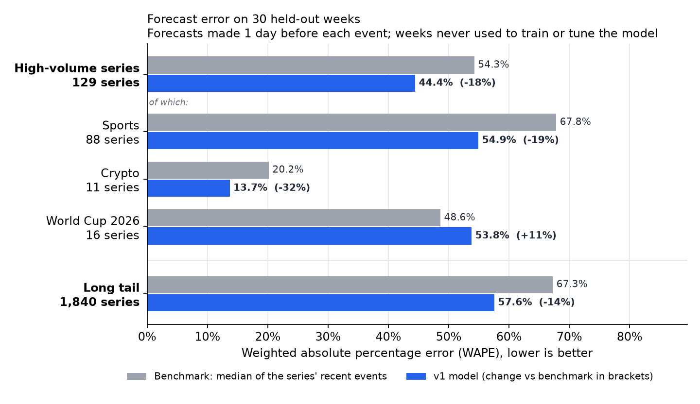

# Forecasting demand for Kalshi event contracts

How many contracts will a prediction-market event trade? This project forecasts it for every recurring event on [Kalshi](https://kalshi.com), the US-regulated event exchange, using only its public API.

On 30 held-out weeks never used to train or tune the model, a LightGBM model forecasting how many contracts each Kalshi event will trade cut error by **18% for high-volume series** and **14% for the long tail**, relative to trailing-median benchmarks. It identified more of the busiest events (**73% of the top 10%, against 68%**), and a companion Tweedie model produced daily totals with **26% lower error** than a trailing-mean benchmark and bias within 5%. Its 80% prediction intervals covered 80.4% of outcomes, though they are wide, reflecting how much demand for a single event varies. It beats an analogue baseline for newly launched series, but underperforms at the start of tournaments and new seasons, where demand shifts faster than its history-based features can follow.



| | |
|---|---|
| **Data** | Kalshi public API: 11,273 series, about 17.2 million markets, crawled across the live and historical tiers |
| **Forecast target** | Total contracts traded per event (per series-day for hourly and 15-minute markets): 429,201 forecasting units |
| **Forecasts** | At listing, 1 day before and 2 hours before each event: median, mean and 80% interval |
| **Models** | LightGBM median model (L1 on a log-ratio target), LightGBM Tweedie mean model, rolling conformal intervals |
| **Evaluation** | Validation (8 weeks, used for every choice) → test (30 weeks, scored once) → frozen-pipeline holdout on events after the freeze |
| **Release** | [`v1.0.0`](../../releases/tag/v1.0.0): pipeline, scoring plan and model card frozen before the holdout period |

**Read more:** [model card](docs/model_card.md) · [holdout plan](docs/holdout_plan.md) · [decision log](docs/decision_log.md) (150+ design decisions, with evidence)

---

## Results on the test weeks

All figures: 30 weeks (2 March to 27 September 2026), forecasts made 1 day before each event, predictions frozen and fingerprinted (SHA-256) before scoring.

| | Benchmark | v1 | Change |
|---|---|---|---|
| High-volume series (129) | 54.3% | **44.4%** | −18% |
| Sports (88 series) | 67.8% | **54.9%** | −19% |
| Long tail (1,840 series) | 67.3% | **57.6%** | −14% |
| Daily totals, all modelled markets | 19.9% | **14.8%** | −26% |
| Busiest 10% of events identified | 68% | **73%** | +5 points |
| Newly launched series | 115.9% (launch analogue) | **97.9%** | −16% |

Error is WAPE (weighted absolute percentage error), lower is better. Gains are broad, not driven by a few big series: the median high-volume series improves from 60.7% to 47.8%, the median tail series from 71.1% to 62.0%.

- **Error by hierarchy level:** [error shrinks as forecasts are summed up the hierarchy](docs/figures/02_error_by_level.png)
- **Ranking:** [finding the biggest events in advance](docs/figures/03_ranking.png)
- **A concrete example:** [one week of NBA games, forecast against actual](docs/figures/04_nba_week.png)
- **What drives the model:** [contribution of each feature group](docs/figures/06_ablations.png). Event characteristics, series history and team popularity carry it; tuning added about 1 point.

## Where it falls short

- **Tournaments and new seasons.** On the 2026 World Cup, v1 was worse than the benchmark (53.8% against 48.6%), and its mean forecast overshot the first week by about 200%. When a series restarts, demand jumps faster than history-based features follow; the most recent few events are the better guide ([figure](docs/figures/07_world_cup.png)).
- **Wide intervals.** The 80% intervals span roughly 18× from low to high. They're calibrated on average, but not series by series: NBA game-winners are over-covered (99%) while noisier sports series are under-covered ([figure](docs/figures/05_intervals.png)).
- **No information arrives between listing and the event.** Accuracy barely changes from listing (45.5%) to 2 hours before (43.9%); live trading activity ("pickup") is the planned v1.1 addition.
- **Single events are inherently noisy.** For decisions, use rankings and aggregates rather than individual point forecasts.

Full list in the [model card](docs/model_card.md).

## How it was evaluated

- **Every choice made on validation weeks only** (January–February 2026): features, tuning (30 Optuna trials under a protocol declared in advance), the mean model and the interval method.
- **Test weeks scored once,** after the pipeline was frozen as release `v1.0.0`. Predictions were saved and fingerprinted before any score was computed.
- **Deterministic:** identical runs give identical predictions; the seed-to-seed spread (0.12 points) is reported so small differences aren't mistaken for findings.
- **Frozen-pipeline holdout:** events from 20 October 2026, scored after the period ends under the [holdout plan](docs/holdout_plan.md) released with `v1.0.0`.
- **Leakage-safe throughout:** every feature, baseline and interval uses only information available when the forecast is made; models retrain weekly on completed events only.

## How it's built

| Stage | Module | What it does |
|---|---|---|
| Ingestion | `src/kalshi_api.py`, `src/crawl.py`, `src/updater.py` | Resumable crawl of both API tiers; the historical tier is read from its cutoff each run, because the live tier silently stops there |
| Event dating | `src/dating.py`, `src/events.py` | Dates each event by when it happens, not when it settles, using validated rules with automated tests |
| Forecasting units | `src/units.py` | Events (or series-days), with issue times at listing, 1 day before and 2 hours before |
| Baselines | `src/baselines.py` | Benchmark ladder: trailing medians and means, weekly naive, category and launch-analogue baselines |
| Features | `src/features.py`, `src/popularity.py` | 35 features in four groups, each computed as of the issue time |
| Models | `src/model_v1.py`, `src/tuning.py`, `src/intervals.py`, `src/frozen_config.py` | Weekly retraining, median and Tweedie models, conformal intervals, frozen configuration |
| Figures | `src/make_figures.py` | Every chart in this README, from the fingerprinted test predictions |

`notebooks/00_data_audit.ipynb` is the working record of the build, in the order it was done.

## Reproducing

Requires Python 3.12 and about 10 GB of free disk for the raw crawl.

```bash
python -m venv .venv
.venv/Scripts/activate            # Windows; on macOS/Linux: source .venv/bin/activate
pip install -r requirements.txt   # exact versions used for v1.0.0
```

Raw data isn't included in this repository; it's pulled from Kalshi's public API, which needs no account. Set the data folder in `src/kalshi_api.py` (`DATA_ROOT`), then follow the notebook's blocks in order.

## Status

- **v1.0.0** frozen and tested (8 October 2026).
- **v1.1** (planned before 13 December 2026): forecast reconciliation across the hierarchy, and live trading activity as a feature. It will be evaluated on events from 14 December 2026 to 31 January 2027.
- **Holdout results** for v1.0.0 (events 20 October to 13 December 2026) will be added after the period ends.

## About

Built by Ashwin as a portfolio project during an MSc in Economics and Data Science at the University of Essex. Not affiliated with Kalshi; nothing here is trading advice.
